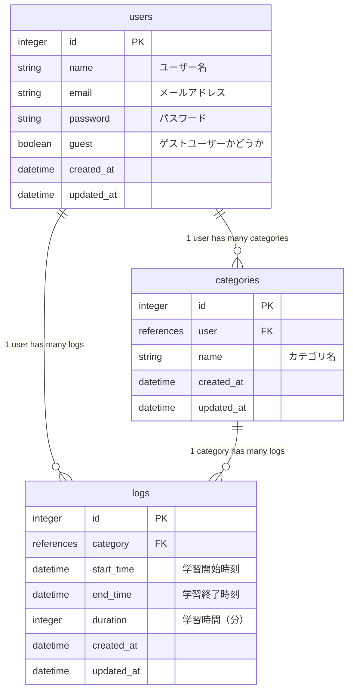

## 📖 はじめに
Daylog は、学習時間を記録し、SNSで共有することで習慣化をサポートするアプリです。  
「学習管理とシェアをもっとスムーズに行いたい」という自身の課題から開発しました。

アプリURL  
https://daylog-x72d.onrender.com/  

## 🎯 開発背景
学習の習慣化と、継続や成長を採用担当者へアピールすることを目的に、日々の学習内容をX（旧Twitter）に投稿していました。  
しかし、学習時間を都度計算したり、投稿文を整える作業に時間を取られ、肝心の学習に集中できないという課題を感じていました。  
そこで、学習時間の記録とSNS投稿をシームレスに行える仕組みを作ることで、**「努力をアピールしながら、学びを続けられる環境」** を実現しようと考えたのがこのアプリを開発した背景です。

同時にこのアプリ開発を通じて、CRUD実装からUI/UX設計・運用など、WEB開発のプロセスを一通り経験することも目的としています。

## ⚙️ 主な使用技術

### バックエンド

### フロントエンド

### インフラ・DB

### ツール

## 📝 アプリ機能

| 機能 | 詳細 |
|-----------|--------|
| タイマー | 学習時間をタイマーで計測できる。終了時に自動で記録を保存。 |
| カテゴリ | カテゴリごとに学習時間を分けて記録できる。作成・編集・削除が可能。 |
| 学習履歴 | これまでの学習記録一覧を確認できる。手動での作成・編集・削除も可能。 |
| シェア | 学習記録をX（旧Twitter）に投稿できる。最初から日付や時間が自動入力され、整形されている。 |
| ゲストログイン | 会員登録不要でお試し利用が可能。サンプルデータが最初から入っている。 |

  
## 🎥 使用イメージ  
https://github.com/user-attachments/assets/89e2e0ba-2539-4a9f-8eea-d9f6fe798f8b

## ER図

## ⚙️ 実装で意識した点
- **保守性と拡張性**  
  RESTfulな設計や、DRY原則に沿ったコード整理を意識し、機能追加や修正が容易になるようにしました。
- **パフォーマンスと安定性**  
  N+1問題の検出に Bullet を導入し、SQLの無駄な発行を防止しました。  
- **ユーザー体験の向上**  
  WebWorker を導入し、マルチスレッドでの正確なタイマー処理を実現しました。

## ✨️ 今後の展望
同じスクールの受講生や友人にも実際に使ってもらい、フィードバックをもらって改善を進めています。

- タイマー作動中にも他ページへ遷移可能に
- スマートフォン向けにUI・動作を最適化
- シェア機能の強化（投稿テンプレートのカスタマイズ・OGP画像など）
- 学習記録をグラフで可視化してモチベーションを高められる機能  

## 🙌 おわりに
Daylog は、「学習管理とシェアをもっとスムーズに行いたい」という自身の課題を解決するために開発しました。
自分の手で最後まで作り切った経験は、今後の現場でのキャリアの土台になると考えています。   
今後も改善を続けていきますので、アドバイスやフィードバックをいただけると嬉しいです。   

